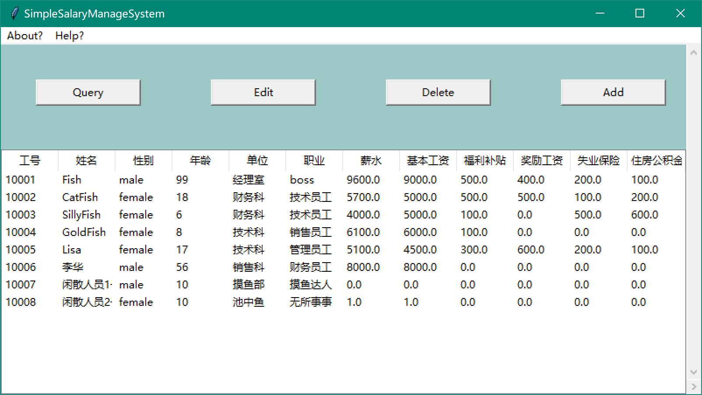
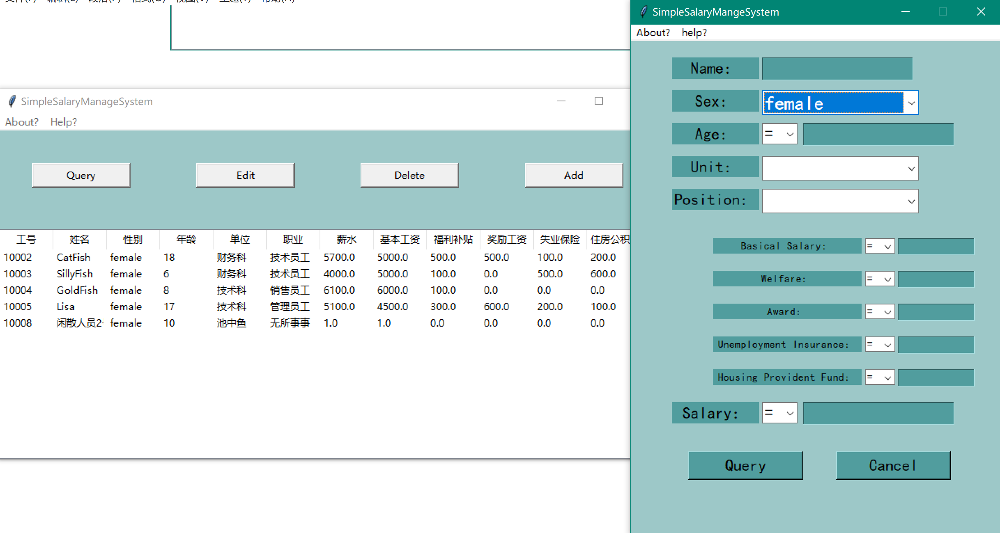

# 😆SimpleSalaryManageSystem😆
>  📙Based on Tkinter&amp;MySQL.

> 数据库课程作业

> 上传下之前的作业，供后来人参考🤷‍♂️

> 主要还是学习使用如何操作数据库，详细的内容介绍可以参看目录下的`实验报告.pdf`

>  另外使用了pyinstaller打包好了exe执行文件，在release下可找到，也可自行使用命令`pyinstaller -w --icon file.ico SimpleSystem.py
`

> 由于之前写完之后就略去了，导致数据库文件缺失，现已附上，并在目录下提交了sql脚本

---

以下是部分功能截图（能力有限🤷‍♂️）：

> 查询

> 添加

